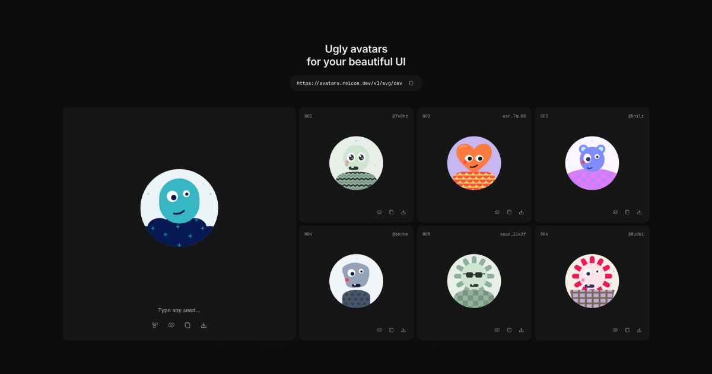
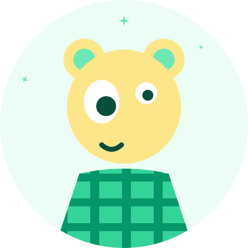
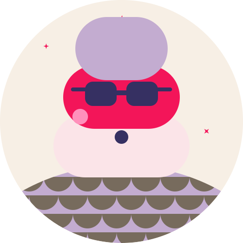
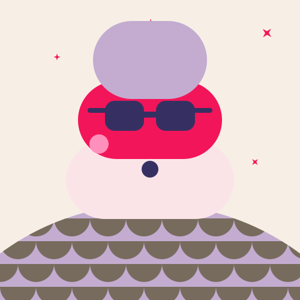
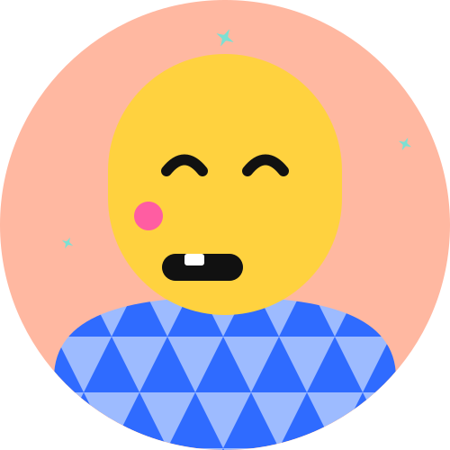
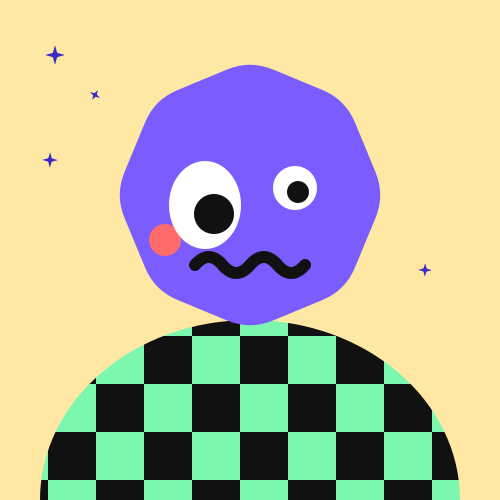

# Ugly Avatars for your Beautiful UI



[](https://avatars.reicon.dev)
[](LICENSE)
[](https://github.com/dqev/reicon-avatars)

Ugly avatars for your beautiful UI. Generate unique, deterministic vector avatars for your web apps and users.

## Quickstart

Embed generative avatars directly into HTML, React, Vue, Svelte, or any framework using simple image tags.

```html

```

### Visual Preview

| Seed: `alex` (Shape: `squircle`) | → | Seed: `sarah` (Shape: `circle`) |
| :---: | :---: | :---: |
|  | → |  |

## API Endpoints

Consume vector avatars via HTTP GET requests on our global edge network (`https://avatars.reicon.dev`).

```http
GET https://avatars.reicon.dev/v1/svg/{seed}?shape=square|circle|squircle&size=500
GET https://avatars.reicon.dev/v1/json/{seed}
```

| Format | Endpoint | Description |
| :--- | :--- | :--- |
| **SVG** | `GET /v1/svg/{seed}` | Returns clean vector SVG image markup (`image/svg+xml`) |
| **JSON** | `GET /v1/json/{seed}` | Returns structured JSON payload with raw SVG markup (`application/json`) |

## Parameters

Customize output shape, dimensions, and seed values via query parameters.

| Parameter | Type | Default | Description |
| :--- | :--- | :--- | :--- |
| `seed` | `string` | `avatar` | Path parameter. Any string, email, or user ID used for 100% deterministic avatar generation. |
| `shape` | `string` | `square` | Outer clipping mask. Options: `square`, `circle`, or `squircle`. |
| `size` / `width` / `height` | `number` | `500` | Output resolution in pixels (e.g. `250`, `400`, `500`). |

## Shapes & Clipping Masks

Control outer geometry using the `shape` query parameter. Choose between `circle`, `squircle`, or `square`.

| `shape="circle"` | `shape="squircle"` | `shape="square"` |
| :---: | :---: | :---: |
|  |  |  |

## Seed Determinism

Pass any string, email, or user ID as a seed. The generator produces a 100% unique avatar with consistent palette, torso pattern, and expression every single time.

| `seed="user_101"` | `seed="octocat"` | `seed="antigravity"` |
| :---: | :---: | :---: |
|  |  |  |

## Formats (SVG, JSON)

Vector SVG images for web apps, or structured JSON payloads with raw SVG markup.

### JSON Response Format (`GET /v1/json/dev`)

```json
{
  "seed": "dev",
  "shape": "square",
  "size": 500,
  "svg": "<svg width=\"500\" height=\"500\" ...>...</svg>"
}
```

## Rate Limits & Caching

Edge requests are rate limited to **100 requests per minute per IP**.

- **Diagnostic Headers**: Responses include rate limit headers (`X-RateLimit-Limit`, `X-RateLimit-Remaining`, `X-RateLimit-Reset`).
- **CDN Caching**: Immutable CDN caching (`Cache-Control: public, max-age=31536000, immutable`).

## Deployment & Local Setup

```bash
# Clone the repository
git clone https://github.com/dqev/reicon-avatars.git
cd reicon-avatars/worker

# Install dependencies
npm install

# Run local development server
npm run dev

# Deploy Cloudflare Worker API
npm run deploy
```

## License

MIT License © [Reicon Avatars](https://github.com/dqev/reicon-avatars)
